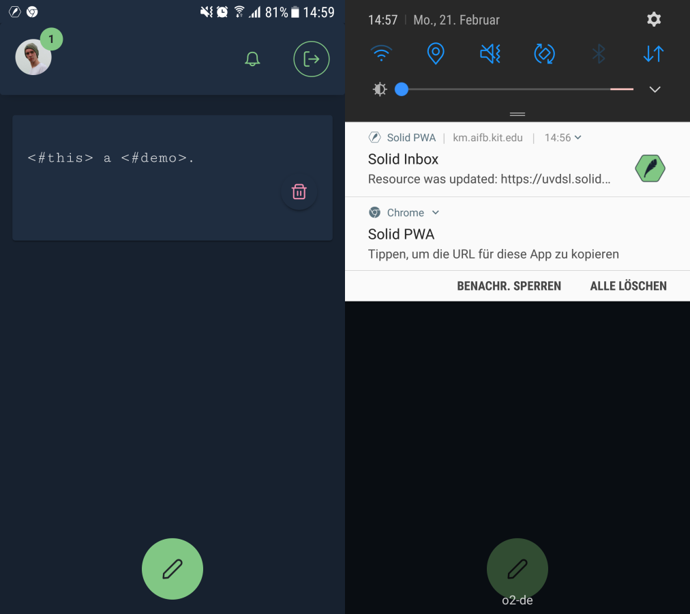
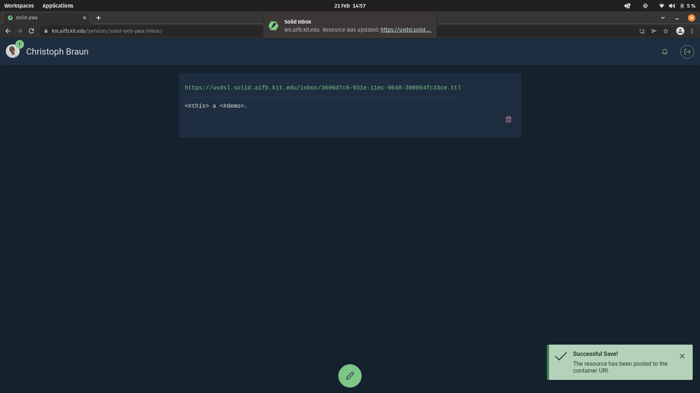

# Solid PWA

This Prgressive Web Application is a demo for [Solid](https://solidproject.org) PWAs.
A user can choose to receive Web Push Notifications to receive updates on his or her Solid Pod's inbox.

- [x] Login with your Solid WebID.
- [x] Fetch some resource from a Solid Pod.
- [x] Create a new Resource in some container, e.g. your inbox.
- [x] Responsive design. Try it on your mobile device!
- [x] Add to Homescreen: Install it on your device!  
(Gotcha: Firefox does not support that PWA feature... smh)
- [x] Update to new Version: You are notified when we update the App!
- [x] Push Notification: Hey, wake up! Your Pod's inbox has been updated (using [uvdsl/solid-web-push](https://github.com/uvdsl/solid-web-push)).  
(Gotcha: Safari does not support Web Push.)


## Gotcha!
- The service worker is disabled in development mode (> npm run serve).
- To test the service worker locally, you have to build the app (> npm run build) and then serve it locally via some webserver. I use my Solid Pod for that.
- Firefox does not support installing PWAs.
- Safari does not support Web Push Notifications. Certainly not on iOS, and I could not verify it on macOS. Let me know!

## .env
See the [.env.example](./.env.example) for configuring the path of the application to be served from.

## Build and run using Docker
```
docker build -t solid-web-pwa:latest .
docker run -d -p 8080:80 --name SOLID-WEB-PWA solid-web-pwa:latest
```

## Project setup
```
npm install
```

### Compiles and hot-reloads for development
```
npm run serve
```

## Screenshots

  

